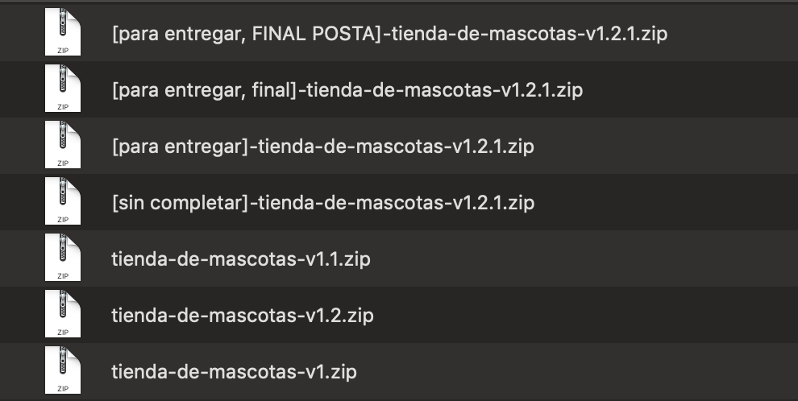
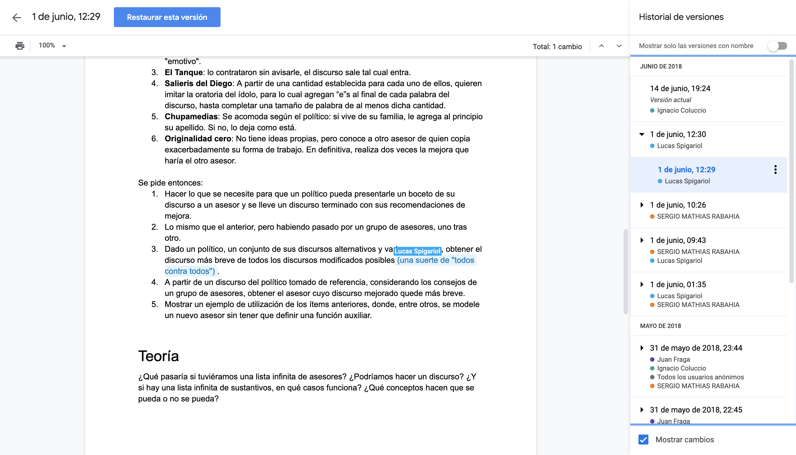
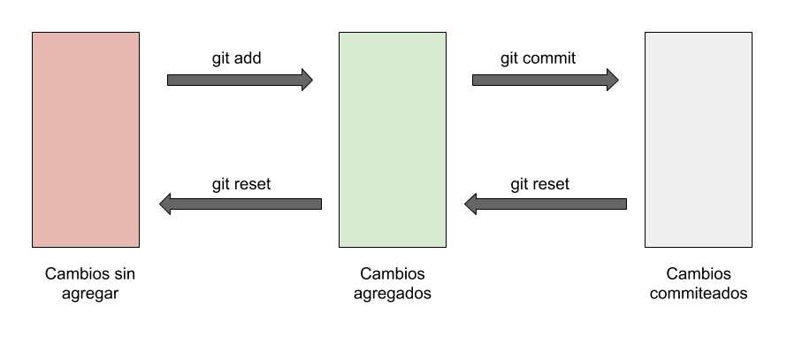
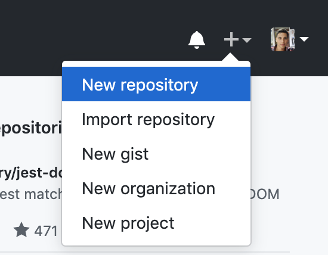

## Introducción a Git y GitHub

Creando para que aprendan los conceptos básicos de **git** y **GitHub** así pueden manejarse con facilidad subiendo código a repositorios y haciendo cambios.

## Antes de empezar

Cuando vean un contenedor de código.

- El símbolo `$` indica que es un comando de terminal. No se copia.
- El símbolo `#` indica el comienzo de un comentario. No se copia (y si se copia no pasa nada).
- Cuando hay algo rodeado entre `[]` significa que lo tienen que reemplazar por lo que les diga, omitiendo los corchetes.
- Los cuadrados con código puede que tengan un scroll horizontal, si no entran.

Por último, usando la terminal, sepan **dónde están parados**. Los comandos que ingresen van a ejecutarse en el directorio en donde estén parados con la terminal. Para ver dónde están, pueden  usar el comando `pwd`. Por seguridad, hagan todas sus pruebas desde una carpeta vacía que ustedes creen.

## Paso 0

Para empezar vamos a tener algunos requisitos previos.

1. **Terminal compatible con unix** instalada y lista para usar.
2. **Conocimientos comandos básicos unix**, para manejarse entre archivos, crear carpetas, etc. desde la terminal (si no saben tampoco es problema, pero es algo menos que entender).
3. **git** instalado en su máquina. Pueden confirmar que esté instalado escribiendo.

```bash
$ git --version
```

4. Una **cuenta en GitHub**.

Ahora sí, estamos listos para empezar.

## El problema

Hubo una época en la que Google Drive no existía, o no sabía que existía.

No sé ahora cómo serán las cosas, pero cuando iba a la secundaria, hacíamos TPs, nos mandábamos los cambios por mail, o las diferentes partes para que otro después una todo.

Había varios problemas con esta forma de trabajar.

- Alguien del grupo tenía que juntar todas las partes.
- No estábamos seguros de lo que se estaba trabajando.
- Tampoco estábamos seguros de lo que ya se había hecho.
- El resultado final no era coherente entre partes.
- No hablemos de versionado...



Luego llegó Google Drive.

Eso nos resolvió todo para hacer TPs, incluso si alguien la pifiaba y borraba algo importante, podíamos acceder a versiones anteriores del archivo y arreglarlo. Además [con algo de trabajo](https://support.google.com/drive/answer/2375012?co=GENIE.Platform%3DDesktop&hl=es) se puede trabajar sin conexión y luego subir los cambios sin necesidad de crear otros archivos.

Lo cual es genial.



Pero trabajar un documento es distinto a un programa con muchos archivos, sub carpetas, etc.

Estaría bueno contar con un sistema que sea como Google Drive pero para carpetas, o **_repositorio_** de archivos. Y que además sea simple de usar, sin necesidad de conectarse a una interfaz que nos relentice este proceso...

Por suerte contamos con una herramienta que hace todo lo que dije y mucho más.

## Introducción

> **git** es un sistema de control de versiones, distribuido.

\*insertar meme de que algo no se entiende\*

Vamo de a partes.

### Versionado

Habiendo hecho la comparación podemos entender a lo que se refiere con "control de versiones". Significa que podemos **_trackear cambios_** para saber quién hizo un cambio, qué modificó, permitiéndonos **_volver a versiones anteriores_** si queremos.

### Distribuido

La parte de **_distribuido_** necesita un poco más de explicación que lo anterior.


Vamos a explicar las partes

### Repositorio remoto

Este sería el encargado de guardar todos nuestros cambios en un solo lugar. En Google Drive tenemos un documento al que todos acceden para leer o modificar, acá es igual pero con un repositorio. Y con la leve diferencia de que no se hacen cambios directamente.

Entonces si no se hacen cambios directos?

Cuando queramos trabajar el repositorio remoto, vamos a tener que, **_primero, copiarlo a nuestra máquina_**. A esta copia en nuestra máquina la vamos a llamar [repositorio local](#repositorio-local).

Para trabajar con repositorios remotos, podemos usar plataformas como **GitHub**, Bitbucket, GitLab, u otros.

### Repositorio local

Este otro sería la copia en nuestra máquina del repositorio remoto.

Una vez que contamos con un repositorio local, vamos a ver que podemos modificarlo como cualquier archivo. Pero los cambios no se van a ver reflejados en el repositorio remoto a menos que los subamos.

Para esta parte vamos a usar **git**. La herramienta que nos va a ayudar a llevar cambios localmente, subirlos y traer nuevos cambios.

### Juntando las partes

Entonces podemos decir que es distribuido porque se trabaja en distintas partes, el código no está centralizado en 1 lado solamente.

Si el día de mañana le pasa algo al servidor remoto, no hay de que preocuparse, ya que tenemos una copia.

## Workshop

Vamos a tener 2 caminos.

1. Empezar con un [repositorio de cero](#repositorio-de-cero).
2. Empezar con un [repositorio ya creado](#repositorio-ya-creado).

Para los 2 casos, primero tenemos que configurar un poco **git**.

### Configuración inicial

Configuro mi nombre:

```bash
$ git config --global user.name "[usuario github]" # Usar su nombre de usuario de GitHub
```

Configuro mi mail:

```bash
$ git config --global user.email "[mail github]" # Usar su mail de GitHub
```

Configuro mi editor por defecto

```bash
$ git config --global core.editor "[comando para abrir editor]" # "subl -n -w" para Sublime Text o "code" para VSCode...
```

Si quiero ver los valores que tienen puedo usar

```bash
$ git config --get user.name
```

Si quiero cambiar el `user.name` o `user.email`, simplemente vuelvo a escribir esos comandos con los valores correctos, pisando los que ya haya.

### Repositorio de cero

#### Creando un repositorio local

1. Vamos a la terminal.
2. Creamos una carpeta en algún lado de nuestra compu.
3. Creamos un archivo dentro de la carpeta y le ponemos algún contenido. Acá hay un contenido de ejemplo: [contenido gratis!](https://raw.githubusercontent.com/KeenRivals/bestmotherfucking.website/master/index.html). Pueden hacer `Ctrl + A` para seleccionar todo, y lo copian y pegan (copiar: `Ctrl + C`, pegar: `Ctrl + V`) en el archivo `index.html` que creen.
4. Ahora que tenemos un proyectito metámosle **git**.
5. **Inicializamos** un repositorio con este comando:

```bash
$ git init
```

Quizás no nos dimos cuenta, pero se nos creó una carpeta oculta llamada `.git/`. Acá se va a guardar el historial de cambios, así que es importante no borrarla. Podemos ver los archivos y carpetas ocultas con `ls -a`.

#### Viendo el estado

Un comando que vamos a usar todo el tiempo:

```bash
$ git status
```

Nos dice el **_estado de nuestro repositorio_**. Cada vez que tiramos un comando podemos cambiar el estado del repositorio, para verlo lo hacemos con `status`.

Generalmente queremos asegurarnos de hacer las cosas bien, y para no pifiarla vemos el estado antes de hacer algo, por eso se usa bastante.

Habiendo tirado el comando, nos va a decir que no hay cambios que hacer, que hay un archivo sin seguimiento, porque es nuevo, no tiene historial.

#### Agregando un cambio

Tanto para agregar un cambio, archivo nuevo, borrado, etc. vamos a usar

```bash
$ git add [nombre_archivo]
```

Ahora, es importante entender que podemos tener un cambio en 3 estados, uno cuando está **_modificado_** y sin agregar, otro **_agregado_** y por último **_"commiteado"_**.



El estado commiteado lo vamos a ver después, pero sería como asegurar el cambio que agregamos, sumándole un mensaje.

Así que al agregar el cambio no estamos confirmándolo todavía.

También está bueno tener en cuenta que yo puedo agregar un archivo, modificarlo y agregarlo de nuevo.

Podemos agregar archivo por archivo... o usar un `*` para indicarle que queremos agregar todos los archivos.

```bash
$ git add -A
```

**Pero momento!** Qué pasa si nos equivocamos y agregamos un archivo que no iba.

A no preocuparse, _tenemos un comando para revertir el que les acabo de enseñar_:

```bash
$ git reset [nombre_archivo]
```

Si no especificamos archivo nos va a hacer reset de todo.

#### Confirmando el cambio

Al confirmar el cambio vamos a agarrar todos los cambios a agregar que pusimos y unir todos esos cambios en 1 commit, que sería como una contribución.

Para eso lo vamos a hacer con:

```bash
$ git commit -m "[un mensaje descriptivo]"
```

Por favor, que el mensaje sea descriptivo... si le ponemos como mensaje _"foo"_, _"bar"_, cuando veamos el historial de cambios no vamos a entender nada. O sus compañeros los van a mirar mal.

Y cómo vemos el historial de cambios (commits)?

_Hay un comando para eso._

```bash
$ git log
```

Si queremos un mensaje más conciso le podemos agregar la opción `--oneline`.

```bash
$ git log --oneline
```

**Pero momento!** Qué pasa si nos equivocamos y commiteamos algo equivocado.

A no preocuparse, _tenemos unos comandos para arreglarlo_.

Si queremos pisar el commit podemos seguir los siguientes pasos:

1. Modificar lo que queramos, borrar, o lo que queramos hacer.
2. Agregar nuestros cambios `git add *`.
3. Pisar nuestro commit:

```bash
$ git commit --amend
```

Esto nos va a abrir el editor por defecto que hayamos elegido. Podemos cambiarle el nombre al commit si nos equivocamos en algo, salvar el archivo, y estamos listos. Pero solo modifiquen la primer línea, lo otro déjenlo igual.

Difícil? Aunque no lo crean no mucha gente que usa git sabe de ese comando, pero es súper útil.

**_Otra alternativa_** que tenemos, cuando ya tenemos 1 commit o más, o sea no lo podemos usar para revertir el primer commit, es con `reset`. Pero para probar esa alternativa vamos tener que agregar otro cambio antes.

Ahora probemos de agregar otra página a la web y linkearla, o simplemente agregar un archivo nuevo y modificar el anterior que creamos.

De paso les digo que si tienen una modificación que quieren revertir, y todavía no agregaron (con `add`). Pueden ver las diferencias con

```bash
$ git diff
```

y volver al estado anterior con

```bash
$ git checkout [nombre archivo]
```

o para revertir TODAS las modificaciones

```bash
git checkout .
```

Una vez que tenemos el cambio hecho, vamos a agregar los cambios y commitearlos como ya vimos.

```bash
$ git add -A
```

```bash
$ git commit -m "agrego nueva página"
```

Después de eso prueben de hacer `git log` a ver qué les dice.

Y recuerden de tirar `git status` así van viendo el estado del repositorio.

Ahora podemos revertir ese commit con:

```bash
$ git reset HEAD~1
```

Si hacemos `git log` nuestro commit desapareció, pero no se preocupen, seguimos teniendo el cambio, se pueden fijar con `git status`.

#### Usando la nube

Todo lo venimos manejando localmente, en nuestra compu, lo cual puede ser algo aburrido. Vamos a subirlo a internet.

1. Ir a [GitHub](https://github.com/).
2. A la derecha arriba van a tener un botón que les va a expandir un menú, y les va a decir de crear un repositorio.



3. Darle un nombre al repositorio y dejar las otras opciones como están.
4. Felicitaciones! Ahora tienen un repositorio en internet... pero está vacío 👀

El buen GitHub les da las instrucciones para vincular un repositorio local al que recién crearon.

Pero les voy a decir los pasos igual.

Si se fijan ahora tienen una url para referenciar al repositorio. Va a ser algo como `https://github.com/normanperrin/mi-repositorio-genial.git`.

Vamos a usar esa url para vincularla con el repositorio local. Le vamos a decir que suba y traiga los cambios de ahí.

Cómo?

5. Posicionados en nuestro repositorio vamos a escribir:

```bash
$ git remote add origin https://github.com/[usuario]/[nombre de repositorio].git
```

Esto va a declarar la variable `origin` con el valor de la url que le pasamos.

Para ver a dónde quedó apuntando nuestro repositorio podemos hacer

```bash
$ git remote show origin
```

**Pero momento!** Qué pasa si nos volvimos a equivocar y pusimos la url mal.

No hay problema, podemos pisar el valor de `origin` así

```bash
$ git remote set-url origin https://github.com/[usuario]/[nombre de repositorio].git
```

Nos debería decir que se hace `fetch` (traer cambios) y `push` (subir cambios) a la url que le pasamos.

6. Ahora que los tenemos referenciados, podemos **_pushear_** nuestros cambios.

```bash
$ git push origin master
```

Y si alguien subió cambios, podemos traer cambios con

```bash
$ git pull origin master
```

Si ahora nos fijamos en el repositorio remoto, ya tenemos nuestros cambios subidos, el repositorio no está vacío, sino que tiene nuestro código!

**Pero momento!** Qué pasa si nos equivocamos (otra vez...) y subimos algo que no iba.

No se preocupen, _tenemos un comando para arreglarlo_.

```bash
$ git revert [hash]
```

Pero qué demonios es el **_hash_**?

Es un **_código identificador del commit_**. Lo podemos ver con

```bash
$ git log --oneline
```

Van a ver que aparece un código al principio de cada commit, esa es el _hash_. Entonces para revertir un commit tenemos que indicar qué commit queremos revertir, referenciando su _hash_.

Por ejemplo si vemos algo como:

```console
f6069db (HEAD -> master, origin/master) otro mensaje descriptivo
87c0987 mensaje descriptivo
```

Y queremos revertir el segundo commit, tendríamos que hacer

```bash
$ git revert f6069db
```

Luego elegir un nombre para el commit que va a revertir el segundo commit, guardar el archivo, cerrar el editor.

Y si nos fijamos ahora con `git log --oneline` vamos a ver que tenemos 3 commits en vez de 2. Y que el 3ro revierte el 2do commit.

Así que una vez commiteado pusheamos los cambios para que el repositorio remoto tome el cambio.

### Repositorio ya creado

Si tenemos el repositorio remoto creado, con commits. En vez de crear uno nuevo deberíamos copiarlo a nuestra máquina, o clonarlo. Así que nos vamos a salvar de hacer `git init` y toda la cosa con `git remote`.

Para esta parte vamos a seguir estos pasos:

1. Vamos a la terminal.
2. Vamos a un directorio vacío.
3. Clonamos el repositorio remoto a nuestra máquina.

```bash
$ git clone https://github.com/[usuario]/[nombre del repositorio].git
```

Van a ver que se creó una carpeta en donde estaban. Esa carpeta es su repositorio local.

Y ya está, si entramos a la carpeta del repositorio y nos fijamos con `git remote show origin` a dónde apunta, ya nos dice que está apuntando a la url que se usó para clonar.

Así que de acá en adelante pueden seguir los pasos de [viendo el estado](#viendo-el-estado).

## TLDR

### Configurar git

| Comando                                            | Descripción                   |
| -------------------------------------------------- | ----------------------------- |
| `git config --get user.name`                       | Ver valor de configuración    |
| `git config --global user.name "[usuario github]"` | Configurar nombre usuario     |
| `git config --global user.email "[email github]"`  | Configurar email usuario      |
| `git config --global core.editor "code"`           | Configurar editor por defecto |

### Creando y clonando un repositorio

| Comando                                                               | Descripción                                 |
| --------------------------------------------------------------------- | ------------------------------------------- |
| `git init`                                                            | Inicializa un repositorio git               |
| `git clone https://github.com/[usuario]/[nombre del repositorio].git` | Crea una copia local del repositorio remoto |

### Trabajando localmente

| Comando                         | Descripción                                            |
| ------------------------------- | ------------------------------------------------------ |
| `git status`                    | Ver estado repositorio                                 |
| `git checkout [nombre archivo]` | Revertir modificación                                  |
| `git diff`                      | Ver diferencia actual versión y modificación           |
| `git add [nombre archivo]`      | Agregar un cambio                                      |
| `git reset [nombre archivo]`    | Revertir un cambio                                     |
| `git commit -m "[mensaje]"`     | Agregar un commit                                      |
| `git commit --amend`            | Pisar un commit                                        |
| `git log`                       | Ver historial commits                                  |
| `git reset HEAD~1`              | Sacar último cambio de estado commiteado, a modificado |
| `git revert [hash]`             | Revertir un commit                                     |

### Trabajando en la nube

| Comando                                                                                 | Descripción                                             |
| --------------------------------------------------------------------------------------- | ------------------------------------------------------- |
| `git remote show origin`                                                                | Ver valor de variable origin                            |
| `git remote add origin [https://github.com/[usuario]/[nombre del repositorio].git]`     | Agregar variabl origin                                  |
| `git remote set-url origin [https://github.com/[usuario]/[nombre del repositorio].git]` | Pisar variable origin                                   |
| `git remote show origin`                                                                | Ver a dónde sube y de dónde trae cambios el repositorio |
| `git push origin master`                                                                | Subir commit al repositorio remoto                      |
| `git pull origin master`                                                                | Traer cambios del repositorio remoto                    |

## Cierre

Aunque fueron varios temas, quedan muchos otros. Lo bueno es que con estos ya se pueden ir manejando.

Temas a investigar para continuar: branches, resolución de conflictos y flujo de trabajo con GitHub.

Afortunadamente, **git** es una herramienta muy popular, y como esta guía, hay muchas más que explica cómo usarlo, juegos interactivos, cheatsheets, y es fácil conseguir ayuda si tenemos un problema.

A mi me pueden encontrar en mi [twitter](https://twitter.com/normanperrinok/) donde subo cosas random. O mejor, pueden unirse al [slack de Free Code Camp BA](https://freecodecampba.org/chat/) donde no solo yo estoy para ayudar, sino que un montón de otras personas.

Por último les dejo algunos recursos:

- [Un montón de recursos en 1 página](https://try.github.io/).
- [Ejercicios de Free Code Camp](https://guide.freecodecamp.org/git/).
- [Charla introductoria a git](https://youtu.be/4fbzjJH5LIQ/).
- [Repositorio con este doc](https://github.com/NormanPerrin/nperrin/blob/master/data/tech/2019-05-18-guia-introduccion-a-git.md).
